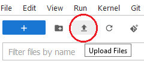
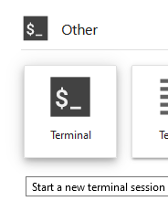

## Add files with drag and drop
Drag and drop files to the left sidebar.  
Note: doesn't work for folders. To transfer a folder, zip it first then drop it, and unzip it (Open a terminal then type `unzip "examplefolder.zip"`).  
See also the [Commands notebook](Commands.ipynb).

## Upload files with the upload menu 
Click the upward arrow in the left sidebar:  
   
Same as for Drag and Drop: to transfer folders, zip then unzip them.  

## Download files to your computer
Select file(s) to download then Right click and select Download in the menu. This will prompt you to decide Open or Save for each file.

## Connect to your data directory on NESE
Open a terminal from the launcher tab:  
  
Start a sftp session:   
`sftp username@server-node.mit.edu:/path/to/wanglab/data/directory/USERFOLDER ~/my-nese-data`  
  
* To download your data from the server:   
   For a file `get mydatafile`  
   For a folder `get -r mydatafolder` 
   
* To push them to the server:  
    `put mydatafile`  
    

 See [Essential sftp commands](https://docs.oracle.com/cd/E26502_01/html/E29001/remotehowtoaccess-14.html)

To avoid having to enter your password every time, copy a SSH key to the server
1. Create a SSH key if none exists. e.g. `ssh-keygen -t ed25519 -C "username@mit.edu"`
2. Copy key to the server: `ssh-copy-id username@server-node.mit.edu`

   

